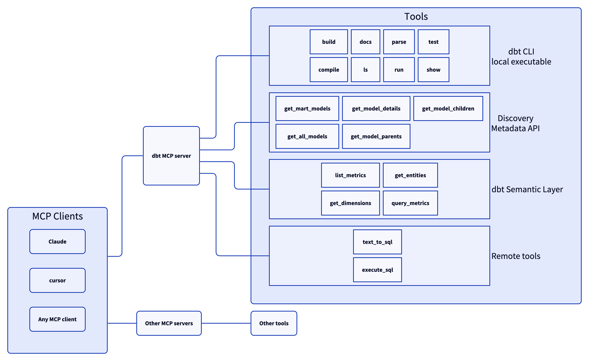

# dbt MCP Server

This MCP (Model Context Protocol) server provides MCP tools to interact with dbt in a few different ways.

In its current form, it allows users to:
- run commands from their local install of the dbt Core or dbt Cloud CLI
- get information about their models and the transformation configured in a given dbt project
- interact with the dbt Cloud Semantic Layer gateway, getting the list of metrics, dimensions and directly querying those

## Architecture



## Setup

1. Clone the repository:
```shell
git clone https://github.com/dbt-labs/dbt-mcp.git
cd dbt-mcp
```

2. [Install uv](https://docs.astral.sh/uv/getting-started/installation/)

3. [Install Task](https://taskfile.dev/installation/)

4. Run `task install`

5. Configure environment variables:
```shell
cp .env.example .env
```
Then edit `.env` with your specific environment variables:
- `DISABLE_DBT_CLI`: Set this to `true` to disable dbt Core and dbt Cloud CLI MCP objects. Otherwise, they are enabled.
- `DISABLE_SEMANTIC_LAYER`: Set this to `true` to disable dbt Semantic Layer MCP objects. Otherwise, they are enabled.
- `DISABLE_DISCOVERY`: Set this to `true` to disable dbt Discovery API MCP objects. Otherwise, they are enabled.
- `DBT_HOST`: Your dbt Cloud instance hostname. This will look like an `Access URL` found [here](https://docs.getdbt.com/docs/cloud/about-cloud/access-regions-ip-addresses). If you are using Multi-cell, do not include the `ACCOUNT_PREFIX` here.
- `MULTICELL_ACCOUNT_PREFIX`: If you are using Multi-cell, set this to your `ACCOUNT_PREFIX`. If you are not using Multi-cell, do not set this environment variable. You can learn more [here](https://docs.getdbt.com/docs/cloud/about-cloud/access-regions-ip-addresses).
- `DBT_ENV_ID`: Your dbt environment ID.
- `DBT_TOKEN`: Your personal access token or service token. Service token is required when using the Semantic Layer.
- `DBT_PROJECT_DIR`: The path to your dbt Project.
- `DBT_PATH`: The path to your dbt Core or dbt Cloud CLI executable. You can find your dbt executable by running `which dbt`.
- `DBT_EXECUTABLE_TYPE`: Set this to `core` if the `DBT_PATH` environment variable points toward dbt Core. Otherwise, dbt Cloud CLI is assumed


## Using with MCP Clients

After going through [Setup](#setup), you can use your server with an MCP client.

This configuration will be added to the respective client's config file:

```json
{
  "mcpServers": {
    "dbt": {
      "command": "<path-to-this-directory>/.venv/bin/mcp",
      "args": [
        "run",
        "<path-to-this-directory>/src/dbt_mcp/main.py"
      ]
    }
  }
}
```
Be sure to replace `<path-to-this-directory>`

If you encounter any problems. You can try running `task run` to see errors in your terminal


## Claude Desktop

Follow [these](https://modelcontextprotocol.io/quickstart/user) instructions to create the `claude_desktop_config.json` file and connect.

You can find the Claude Desktop logs at `~/Library/Logs/Claude`.


## Cursor

1. Open the Cursor menu and select Settings → Cursor Settings → MCP
2. Click "Add new global MCP server"
3. Add the config from above to the provided `mcp.json` file
4. Verify your connection is active within the MCP tab

Cursor MCP docs [here](https://docs.cursor.com/context/model-context-protocol) for reference


## VS Code

1. Open the Settings menu (Command + Comma) and select the correct tab atop the page for your use case
    - `Workspace` - configures the server in the context of your workspace
    - `User` - configures the server in the context of your user
2. Select Features → Chat
3. Ensure that "Mcp" is `Enabled`


4. Click "Edit in settings.json" under "Mcp > Discovery"

5. Add your server configuration (`dbt`) to the provided `settings.json` file as one of the servers
```json
{
    "mcp": {
        "inputs": [],
        "servers": {
          "dbt": {
            "command": "<path-to-this-directory>/.venv/bin/mcp",
            "args": ["run", "<path-to-this-directory>/src/dbt_mcp/main.py"]
          }
        }
    }
}
```

After setup you can start, stop, and configure your MCP servers by:
- Running the `MCP: List Servers` command from the Command Palette (Control + Command + P) and selecting the server
- Utlizing the keywords inline within the `settings.json` file


VS Code MCP docs [here](https://code.visualstudio.com/docs/copilot/chat/mcp-servers) for reference
